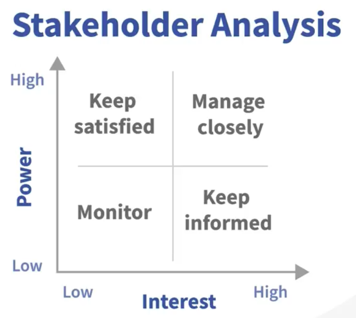

# Problem Solving Strategies for Data Engineers

Every big problem was once a small problem!

## Roles and Phases

Data Engineer:
Build pipeline between source and user (person or system), design, build and maintain systems to collect, store, and analyze data.

Use Cases:
- Process IoT data
- Optimze ecommerce
- Analyze web traffic and sales

Infrastructure:
- Databases
- Processing
- Frameworks
- Scheduling
- Messaging

End-to-End Pipelines: Use infrastructure to create complex processes to query, process, and store data.
Pipeline: 

Data Source &rarr; Data integration &rarr; Transform 1, 2, 3, ..., Cleaning &rarr; store &rarr; person using data

Skills needed:
- Software engineering
- Data integration
- Databases

Analysis: To better understand what's happening in our system

**Engineering is critical**

Working with:
- Analysts
- Scientists
- Businesses
- Other Engineers

Phases
1. Planning
2. Design
3. Implementation
4. Operations

Actually a cycle to improve the system constantly.

Planning: Like a pyramid, need good foundation
- Define requirements
- Set the right KPIs
- Understand the status quo
- Eyeball the efforts

Design goals: Time and Money vs Quality, trade-off
- Effort vs. implementation
- Choose the right architecture or framework
- Predict cost and scale
- find the right benchmark

Implementation
- Define work packages and responsibilities
- Test the right parts
- Create good documentation
- Ensure Data Catalouge and Governance

Operations
- Set up monitoring
- Bug fixing
- Training
- Improve processes

**General challenges faced**
1. Miscommunication
2. Changing requirements
3. Unrealistic Milestones
4. Budget issues

Avoid Miscommunication:
- Be clear and concise
- Be transparent
- Share ideas
- Try to leave out emotions
- Actively listen
- Be open to compromise
- Pick your fights
- Keep good notes
- Escalate if needed
- Update your team

Changing Requirements
- Work together
- Create deadlines (together)
- Let your counterpart sign off on it
- Update your team
- Share with leadership

Addressing Unrealistic Milestones and Budget
- Raise concerns immediately
- Document
- Create an overview
- Show consequences

The Right Motivation
- Find who supports you
- Bring support on board
- Inform leadership
- Watch adversaries
- Stay in communication 

If necessary, make a short stakeholder analysis:

**Main thing: Communication!**

## Planning

First step: Figure out the status quo. A lot of people ignore this. Need to understand what is good, what is not good.

Status Quo
1. Who is involved?
2. What's the goal?
3. What's in place?
4. How does it scale?
5. What's the cost?
6. Does it align?

Requirement Problems
- Engineers don't know the KPIs.
- They are told the wrong KPIs.

Wrong KPIs: Lead to unexpected problems, cost, or need for an early redesign

Types of KPIs:
- Project KPIs: Topics oriented to project management and big picture
	- Budget per year
	- Expected required scalability 
	- Data/System availability and retention
	- Backup and recovery
	- Data sources and integration
	- Security and privacy
- Day-to-Day KPIs: Technical indicators that are monitored on a daily basis 
	- Data volume
	- Data quality/error rate
	- Processing latency
	- Query performance 

Scalability Example:
- Predictions
- Data volumes
- Expected users
- Horizontal or vertical scaling requirements 
- Future ops capability

Defining good KPIs:
- Relevant
- Specific
- Measurable
- Time-bound

Good KPI Factors
- Easy to understand
- Comparable
- Reliable

Examples for KPIs: "Decrease end-to-end processing by 5 seconds until 31st March 2023."
- Action: Decrease
- Detail: end-to-end processing
- Value: 5 seconds
- Unit: 31st March 2023

Check KPIs (goals) for *Action*, *Detail*, *Value*, and *Unit*.

## Design

