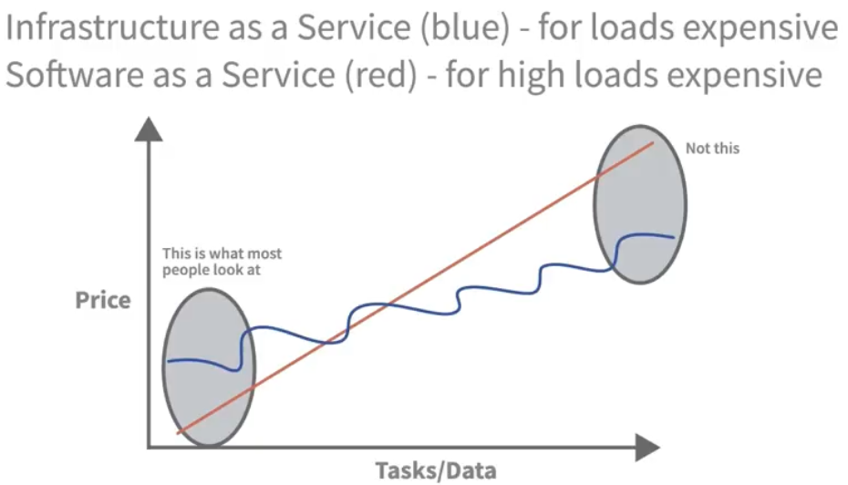

# Problem Solving Strategies for Data Engineers

Every big problem was once a small problem!

## Roles and Phases

Data Engineer:
Build pipeline between source and user (person or system), design, build and maintain systems to collect, store, and analyze data.

Use Cases:
- Process IoT data
- Optimze ecommerce
- Analyze web traffic and sales

Infrastructure:
- Databases
- Processing
- Frameworks
- Scheduling
- Messaging

End-to-End Pipelines: Use infrastructure to create complex processes to query, process, and store data.
Pipeline: 

Data Source &rarr; Data integration &rarr; Transform 1, 2, 3, ..., Cleaning &rarr; store &rarr; person using data

Skills needed:
- Software engineering
- Data integration
- Databases

Analysis: To better understand what's happening in our system

**Engineering is critical**

Working with:
- Analysts
- Scientists
- Businesses
- Other Engineers

Phases
1. Planning
2. Design
3. Implementation
4. Operations

Actually a cycle to improve the system constantly.

Planning: Like a pyramid, need good foundation
- Define requirements
- Set the right KPIs
- Understand the status quo
- Eyeball the efforts

Design goals: Time and Money vs Quality, trade-off
- Effort vs. implementation
- Choose the right architecture or framework
- Predict cost and scale
- find the right benchmark

Implementation
- Define work packages and responsibilities
- Test the right parts
- Create good documentation
- Ensure Data Catalouge and Governance

Operations
- Set up monitoring
- Bug fixing
- Training
- Improve processes

**General challenges faced**
1. Miscommunication
2. Changing requirements
3. Unrealistic Milestones
4. Budget issues

Avoid Miscommunication:
- Be clear and concise
- Be transparent
- Share ideas
- Try to leave out emotions
- Actively listen
- Be open to compromise
- Pick your fights
- Keep good notes
- Escalate if needed
- Update your team

Changing Requirements
- Work together
- Create deadlines (together)
- Let your counterpart sign off on it
- Update your team
- Share with leadership

Addressing Unrealistic Milestones and Budget
- Raise concerns immediately
- Document
- Create an overview
- Show consequences

The Right Motivation
- Find who supports you
- Bring support on board
- Inform leadership
- Watch adversaries
- Stay in communication 

If necessary, make a short stakeholder analysis:

**Main thing: Communication!**

## Planning

First step: Figure out the status quo. A lot of people ignore this. Need to understand what is good, what is not good.

Status Quo
1. Who is involved?
2. What's the goal?
3. What's in place?
4. How does it scale?
5. What's the cost?
6. Does it align?

Requirement Problems
- Engineers don't know the KPIs.
- They are told the wrong KPIs.

Wrong KPIs: Lead to unexpected problems, cost, or need for an early redesign

Types of KPIs:
- Project KPIs: Topics oriented to project management and big picture
	- Budget per year
	- Expected required scalability 
	- Data/System availability and retention
	- Backup and recovery
	- Data sources and integration
	- Security and privacy
- Day-to-Day KPIs: Technical indicators that are monitored on a daily basis 
	- Data volume
	- Data quality/error rate
	- Processing latency
	- Query performance 

Scalability Example:
- Predictions
- Data volumes
- Expected users
- Horizontal or vertical scaling requirements 
- Future ops capability

Defining good KPIs:
- Relevant
- Specific
- Measurable
- Time-bound

Good KPI Factors
- Easy to understand
- Comparable
- Reliable

Examples for KPIs: "Decrease end-to-end processing by 5 seconds until 31st March 2023."
- Action: Decrease
- Detail: end-to-end processing
- Value: 5 seconds
- Unit: 31st March 2023

Check KPIs (goals) for *Action*, *Detail*, *Value*, and *Unit*.

## Design

Need to keep effort of implementation in ming. Expectation vs. Reality!
Complexity is not the *only* problem.

Implementation Efforts
- What tools are needed?
- Are the tools easy to use?
- Are the tools up to date?
- Do the skills of the team fit the tool?
- Is it a flexible solution?
- Do we need such a flexible solution?

Comes back to **Time and Money vs. Quality**.

Choosing the right architecture and framework: *Align to corporate strategy*

Good Architecture
- Privacy regulations
- Security
- Skills of the team meet the need of the tool

External Solutions
- Is this the simplest solution?
- Is it flexible?
- Does it bring value?

Predicting costs and scaling better!
Costs go beyond the technicals.

Pricing Models (Schemas)
- Software license ($/user or month)
- Maintenance license ($/month)
- Instance size ($/hour)*nr of instances
- Data storage ($/1000 messages)

Difficult Pricing Models (Schemas)
- Data throughput ($/GB)
- Processing time ($/minute)
- Messaging processed ($/1000 messages)

Often services combine schemas based on use case.

Calculation
- Use if available
- Revert back to spreadsheet
- Play out different scenarios 

IaaS vs. SaaS vs PaaS

That is why tools like Apache Spark or Kafka exist as standalone tools.

Practical Benchmarking
- Fit to the use case
- Is it possible to model your data?
- Can the processing framework meet processing requirements?
- Ease of use
- Scalability for future use
- Security

Always benchmark *individual tools*. Never fully trust *synthetic* benchmarks. 
Try to *simulate* real-world workloads with *your own data*.

What to benchmark
- Data throughput
- Processing time
- Saling
- Comparison:
	- Today
	- 12 months
	- 24 months
- Latency
	- Database write time
	- Message queue message time between in/out
	- Start-up latency

Always look for *bottlenecks*!

Environmental Benchmarks
- Support
- Pricing models
- Flexibility for use cases
- Vendor lock-in

Industry standard?

## Implementation

Work Packages Issue
- Unclear
- Hard to track
- Responsibilities are unclear

Agile Development
- No big launch
- Develop in small increments
- Packages can be adjusted at any time
- Easier to manage and problem solve

How to define work packages 
- Identify larger deliverables (features)
- Split the deliverables
- Keep packages short
- Add a time value
- Once package is set, add a descriptive title! Then add a detailed description 
- Usually a package has one responsible person

Can track packages e.g. with Azure DevOps.

Risk Assessment: Unforeseen risks become unforeseen problems!

Mitigate Risks
- Identity the assets
- identify the potential threats, e.g.,
	- User access could be denied
	- Database not available
	- Data not updated
	- Missing data
- Analyze the potential impact and prioritize
	- Old school way: Table with Risks, Likelihood and Severity, and rate from 1-5
- Develop mitigation strategies 
	- Avoidance
	- Transfer
	- Mitigation
	- Acceptance

Testing
- What do I test?
- How do I test?
- Did I miss something?

Testing Order
1. Test each individual tool/part of the pipeline.
2. Test end-to-end only after each part has been tested.

Ok and Bad Data
- Test good data
- Test bad data
	- Identify problems and create synthetic data
	- Use existing bad data

What to look for
- Functional requirements fulfilled?
- Is performance ok?
- Security requirements taken into account?
- Error handling implemented and functional?
- Easy to maintain?

Environments
1. Development
	- Open and flexible environment
	- Often involves old data
2. Quality
	- Near production
	- Fewer resources 
	- Regularly mirrored
3. Production
	- Live environment
	- Errors can directly impact customers

Write test documentation!

Documentation: Maintains and improves the pipeline!

Why no Documentation is difficult 
- You do not understand the pipeline
- Fail to locate errors
- Time-consuming 
- Difficult to test
- No access to former employee's best practices

External Documentation 
- Leverage for the whole pipeline
- Internal wiki
- GitHub

Internal Documentation 
1. File
	- Document for a .py source file
2. Function
	- Write documentation that explains what a function does
	- Add parameters
	- Use descriptive names
3. Individual lines
	- Use for important and complex lines

Write Good Inline Documentation 
- Use simple language 
- Be consistent 
- Use speaking variables
- Be concise
- Use short examples

Governance Problems
- Data lakes are swamped
- Access control
- Catalog is missing
- Data quality unknown
- Data lineage is unknown
- Security and privacy not clear

## Operations

Monitoring issues
- Whole systems can fail
- System resources can go low unnoticed 
- Missing data
- No centralized view of system KPIs (like dashboard)
	- Monitor systems and processes together
- No alarm structure hierarchy 

1. System KPIs
	- Resources and overall system status 
		- CPU, RAM, HD usage
		- Network throughput
		- Internal errors
2. Process KPIs
	- Statistics from data processing 
		- Data throughput
		- Processing time
		- Processing lag
		- Internal errors

Need alarm structure! Thresholds for Info, Warn, Alarm, Critical

Error Handling Issues
- Hidden in log files
- You do not know where to star	t
- You do not know if the errors are in the code or in the data
- You do not know how to debug

2. System KPIs
	- Set up a central hub to query
	- Have a good log structure 
		- Message status
		- Timestamp of message
		- For small messages, log raw data directly
		- Amount of not processed data
		- Process time of stage
		- Free text/description

Most of the time the error comes from the data!
1. Data is OK
	- Something normal is happening
	- Error is in the code
2. Faulty Data
	- Malformed data
	- Often originates at the source

Debugging
- Understand the source data
- Find the stage where the error occurred
- Inform yourself what kind of data this stage requires 
- How did to look at the start of the stage?
- Try requesting the data again manually

Data lineage is difficult to monitor in each stage.

Pinpoint the Error Stage
- Test individual steps
- Start from the beginning
- Enable debug log and write the output of the stages
- Compare outputs from the state with expected results 

Debug Code
- Try to find the exact location
- Source code documentation 
- In-line documentation 
- Custom "debug points"

Operational Documentation
- System architecture 
- Maintenance procedures
- Disaster recovery
- Security
- Monitoring
- Incidents reporting
- Release notes
- *Used to teach others*

How to improve processes/what to improve
- Performance
- Automation
- Scalability
- Monitoring
- Data quality
- Security
- CICD

